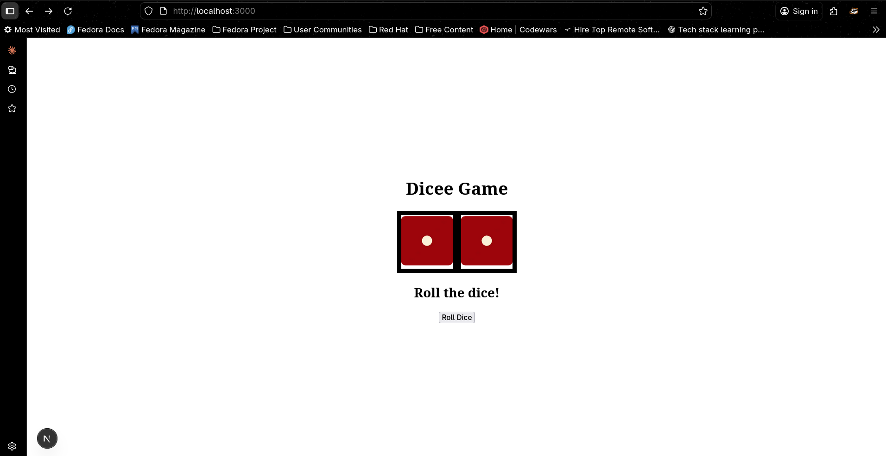

# 🎲 Dicee Game — Next.js + TypeScript


A modern recreation of Angela Yu’s **Dicee Game**, rebuilt using **Next.js**, **TypeScript**, and **Tailwind CSS**.  
Two players roll virtual dice, and the game instantly declares who wins — or if it’s a draw.

---

## 🚀 Features
- 🎨 Clean and minimalist UI  
- 🎲 Two-player dice roll logic  
- ⚡ Instant result generation  
- 🧱 Built with Next.js App Router and TypeScript  
- 🧩 Styled with Tailwind CSS  

---

## 🧱 Tech Stack
| Layer | Technology |
| :---- |:---------------------|
| **Framework** | Next.js (App Router) |
| **Language** | TypeScript |
| **Styling** | Tailwind CSS |
| **Package Manager** | PNPM |
| **Runtime** | Node.js |

---

## 💻 Local Setup

```bash
# Clone the repository
git clone https://github.com/Uthso66/dicee-next.git

# Enter project directory
cd dicee-next

# Install dependencies
pnpm install

# Run development server
pnpm run dev
````

Then open 👉 [http://localhost:3000](https://www.google.com/search?q=http://localhost:3000) in your browser.

-----

## 📸 Preview

Two dice roll side by side with a clear white gap between them — the winner is shown dynamically with smooth transitions and a vibrant gradient background.

### Default View

### Player 1 Wins

### Player 2 Wins

### Draw

-----

## 💡 Inspiration

This project is inspired by **Angela Yu’s “The Complete Web Development Bootcamp”**
Reimagined entirely using **Next.js + TypeScript** for a modern full-stack experience.

-----

## 🧔 Author

**Uthso**
*Software QA Engineer • Security Enthusiast • AI/ML Hobbyist*

🌐 [Portfolio](https://www.google.com/search?q=%23) • 🐙 [GitHub](https://github.com/Uthso66) • 🧠 [LinkedIn](https://www.linkedin.com/in/tarikul-islam-uthso/)

-----

## 🪄 License

This project is licensed under the **MIT License** © 2025 Uthso

